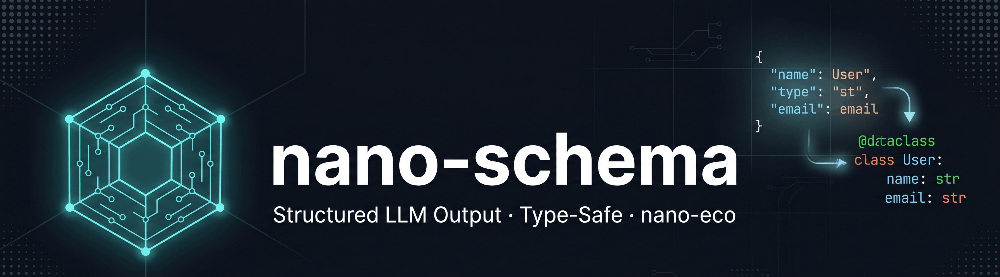

<p align="center">
  
</p>

<h1 align="center">nano-schema</h1>

<p align="center">
  <strong>Force LLM output into typed Python dataclasses — structured extraction with auto-retry</strong><br/>
  No heavy deps. 5 providers. nano-eco integrated. Windows-first.
</p>

<p align="center">
  
  
  
  
</p>

---

## The Problem

LLMs return free text. Production systems need structured data:

```
LLM output:  "The invoice from PT Maju Jaya is five million rupiah, due June 1st."
You need:    Invoice(vendor="PT Maju Jaya", total=5000000.0, due_date="2026-06-01")
```

Parsing LLM output manually is fragile — format varies between calls, numbers come as strings, nested objects break, and one bad response crashes your pipeline.

---

## The Solution

**nano-schema** converts any Python dataclass into a JSON Schema, sends it to the LLM as a strict contract, and parses the response back into a typed object — with automatic retry and self-healing on parse failure.

```python
import dataclasses
from typing import List, Optional
from nano_schema import schema, extract

@schema
@dataclasses.dataclass
class Invoice:
    vendor: str
    total: float
    currency: str
    line_items: List[str]
    due_date: Optional[str] = None

# LLM forced to return this structure
invoice = extract(Invoice, raw_email_text)

print(invoice.vendor)      # "PT Maju Jaya"
print(invoice.total)       # 5000000.0  ← float, not string
print(invoice.line_items)  # ["Web Development", "Server Hosting"]
```

---

## Comparison

| Feature | nano-schema | Instructor | Outlines | Marvin |
|---------|------------|------------|---------|--------|
| Dataclass support | ✅ | ✅ (Pydantic) | ✅ | ✅ |
| Zero extra deps | ✅ | ❌ Pydantic required | ❌ | ❌ |
| Auto-retry + repair | ✅ | ✅ | ❌ | ✅ |
| Batch parallel extraction | ✅ | ❌ | ❌ | ❌ |
| 5 providers | ✅ | ✅ | ⚠️ local only | ✅ |
| nano-eco middleware | ✅ | ❌ | ❌ | ❌ |
| nano-guard integration | ✅ | ❌ | ❌ | ❌ |
| Windows-first | ✅ | ⚠️ | ⚠️ | ⚠️ |
| CLI tool | ✅ | ❌ | ❌ | ❌ |

---

## Installation

```bash
# Core (schema builder + parser, no LLM deps)
pip install nano-schema

# With Anthropic
pip install "nano-schema[anthropic]"

# With OpenAI (also works for Groq, Mistral, Ollama)
pip install "nano-schema[openai]"

# Full
pip install "nano-schema[all]"
```

---

## Usage

### Door 1 — Standalone (any app)

#### Define a schema

```python
import dataclasses
from typing import List, Optional
from nano_schema import schema

@schema
@dataclasses.dataclass
class JobPosting:
    title: str
    company: str
    location: str
    salary_min: Optional[float] = None
    salary_max: Optional[float] = None
    requirements: List[str] = dataclasses.field(default_factory=list)
    remote: bool = False
```

#### Extract from any text

```python
from nano_schema import extract

job = extract(JobPosting, job_listing_html)
print(job.title)        # "Senior Python Engineer"
print(job.remote)       # True
print(job.salary_min)   # 120000.0
```

#### Safe extraction (never raises)

```python
from nano_schema import extract_safe

result = extract_safe(JobPosting, text)
if result.success:
    print(result.data.title)
else:
    print(f"Failed after {result.attempts} attempts: {result.error}")
```

#### Full control with SchemaExtractor

```python
from nano_schema import SchemaExtractor

extractor = SchemaExtractor(
    provider="anthropic",
    model="claude-haiku-4-5-20251001",
    max_retries=3,
)

result = extractor.extract(JobPosting, text)
print(f"Used {result.input_tokens + result.output_tokens} tokens")
print(f"Attempts: {result.attempts}")
```

#### Batch extraction (parallel)

```python
from nano_schema import extract_batch

texts = [doc1, doc2, doc3, doc4, doc5]
results = extract_batch(Invoice, texts, max_workers=4)

for r in results:
    if r.success:
        print(r.data.total)
```

#### Nested dataclasses

```python
@dataclasses.dataclass
class Address:
    street: str
    city: str
    country: str

@schema
@dataclasses.dataclass
class Customer:
    name: str
    email: str
    address: Address
    orders: List[str]

customer = extract(Customer, crm_record_text)
print(customer.address.city)  # fully nested, typed
```

#### Inspect JSON Schema

```python
from nano_schema import build_json_schema
import json

print(json.dumps(build_json_schema(Invoice), indent=2))
```

---

### Door 2 — nano-eco Integration

#### Route through nano-proxy (zero code change)

```bash
export NANO_PROXY_URL=http://localhost:8768   # nano-guard → nano-log → nano-proxy
export NANO_SCHEMA_PROVIDER=anthropic
```

```python
from nano_schema import SchemaExtractor

# Automatically routes through nano-guard + nano-log + nano-proxy
extractor = SchemaExtractor()
result = extractor.extract(Invoice, text)
```

#### With nano-guard (scan input before extraction)

```python
from nano_schema.integrations import extract_guarded

# Input scanned by nano-guard — blocked if PII/injection detected
invoice = extract_guarded(Invoice, raw_document_text)
```

#### Full nano-eco stack

```
Your App
    │
    ▼
nano-schema  ← extract structured data
    │  (NANO_PROXY_URL)
    ▼
nano-guard  :8768  ← scan input/output
    │
    ▼
nano-log    :8767  ← log every call
    │
    ▼
nano-proxy  :8765  ← route to providers
    │
    ▼
LLM Providers
```

---

## Supported Providers

| Provider | Env Var | Default Model |
|---------|---------|---------------|
| `anthropic` | `ANTHROPIC_API_KEY` | `claude-haiku-4-5-20251001` |
| `openai` | `OPENAI_API_KEY` | `gpt-4o-mini` |
| `groq` | `GROQ_API_KEY` | `llama3-8b-8192` |
| `mistral` | `MISTRAL_API_KEY` | `mistral-small-latest` |
| `ollama` | *(local)* | `llama3.2` |

Override model: `NANO_SCHEMA_MODEL` env var or `--model` flag.

---

## CLI Reference

```bash
# Extract from stdin
cat invoice.txt | nano-schema extract schemas.py Invoice --provider anthropic

# Extract from argument
nano-schema extract schemas.py JobPosting "Senior Python dev at Tokopedia..."

# JSON output
nano-schema extract schemas.py Invoice --json < document.txt

# Print JSON Schema for a class
nano-schema schema schemas.py Invoice

# List providers
nano-schema providers
```

---

## Architecture

```
nano_schema/
├── __init__.py           # Public API: schema, extract, extract_safe, extract_batch
├── decorators.py         # @schema decorator, extract() / extract_safe() shortcuts
├── extractor.py          # SchemaExtractor — main engine, retry loop, repair prompt
├── schema_builder.py     # dataclass → JSON Schema, prompt builder, response parser
├── batch.py              # Parallel extraction via ThreadPoolExecutor
├── types.py              # ExtractionResult, ExtractionError, SchemaField
├── extractors/
│   ├── base.py           # BaseExtractor ABC
│   ├── anthropic.py      # Anthropic SDK
│   ├── openai_compat.py  # OpenAI + Groq + Mistral + Ollama
│   └── factory.py        # get_extractor() — picks provider from env or arg
└── integrations/
    └── nano_guard.py     # extract_guarded() — scan input before extraction
```

**Extraction pipeline:**

```
dataclass cls
    │
    ├── build_json_schema(cls)    → JSON Schema dict
    ├── build_prompt(cls, text)   → prompt string with schema + rules
    │
    ▼
LLM call (extractor.complete)
    │
    ▼
parse_response(raw, cls)
    │
    ├── strip markdown fences
    ├── json.loads()
    ├── _dict_to_dataclass()      → coerce types (str→float, etc.)
    │
    ▼
ExtractionResult(success=True, data=Invoice(...))

On parse failure → repair prompt → retry (up to max_retries)
```

---

## nano-eco Ecosystem

| Project | Role |
|---------|------|
| [nano-proxy](https://github.com/ghanibot/nano-proxy) | Multi-provider LLM routing + cost tracking |
| [nano-cache](https://github.com/ghanibot/nano-cache) | Semantic response caching |
| [nano-log](https://github.com/ghanibot/nano-log) | LLM call observability |
| [nano-guard](https://github.com/ghanibot/nano-guard) | Input/output guardrails |
| [nano-tools](https://github.com/ghanibot/nano-tools) | Tool/function calling framework |
| [nano-eval](https://github.com/ghanibot/nano-eval) | LLM evaluation framework |
| **nano-schema** | Structured LLM output ← you are here |

---

## License

MIT © [ghanibot](https://github.com/ghanibot)
